

  <h1>Handover Document</h1>
  <h3>Dalai Lama Foundation - Custom Ghost Theme</h3>

 

## 💻 Project Access Links

| Resource | Link | Description |
| :--- | :--- | :--- |
| **GitHub Repository** | [urbanxtreme/Dalai-Lama-Foundation-New](https://github.com/urbanxtreme/Dalai-Lama-Foundation-New) | *Branch:* `main`   Contains the uncompiled source code. |
| **Google Drive Folder** | [Open Production Assets Folder](https://drive.google.com/drive/folders/1KPyIN3Tu9uRDrn_h5AvU55XbEnXOKRh7?usp=sharing) | Contains all JSON data, routes, assets, and compiled ZIP. |
| **User Manual** | [Read the Management Guide](https://drive.google.com/file/d/1xl_oSoxv7k2pYNT85HzGopQhqAD5mwUG/view?usp=sharing) | Comprehensive instructions for Ghost Admin CMS usage. |

---

## 👥 Developers

*Please contact the developers below for any technical queries regarding the theme architecture.*

| Name | Institution | Contact Email |
| :--- | :--- | :--- |
| **Sreehari S** | College of Engineering Attingal | [skrhari2020@gmail.com](mailto:skrhari2020@gmail.com) |
| **Induchoodan VS** | College of Engineering Attingal | [induchoodanvs2004@gmail.com](mailto:induchoodanvs2004@gmail.com) |

---

## 📁 Google Drive Contents Breakdown

The Google Drive link above contains all necessary production assets required to securely deploy the website to a live Ghost server, perfectly preserving the exact layout, content, and dynamic routing designed locally:

* 📄 **Exported JSON file (`dalai-lama-foundation.ghost.2026-03-29-09-45-37.json`)**
  Contains all the structural posts, configured pages, dynamic section titles, and tags configured to populate the site without any hardcoding.

* 🔀 **`routes.yaml`**
  Contains the custom routing logic required for the `/partner-cta/` and `/our-work/` endpoints used by the Navigation Menu.

* 🖼️ **Assets Folder (`Dalai Lama Assets`)**
  Contains all perfectly optimized `.webp` images, partner logos, header backgrounds, and embedded media used throughout the site.

* 📦 **Theme ZIP File (`mytheme-compressed.zip`)**
  The packaged Ghost theme module, 100% compatible, ready to be uploaded to the instance server.

> **Important Note:** The theme strictly adheres to a "No Hardcoding Policy". The User Manual is absolutely essential for configuring the site's content directly from the Ghost Admin Panel!

## 💯 Theme Compatibility (G-Scan)

The theme has been run through the official Ghost Theme Validator (GScan) to ensure 100% compatibility, security, and usage of mandatory Ghost features. 

**Final Score:** 100/100

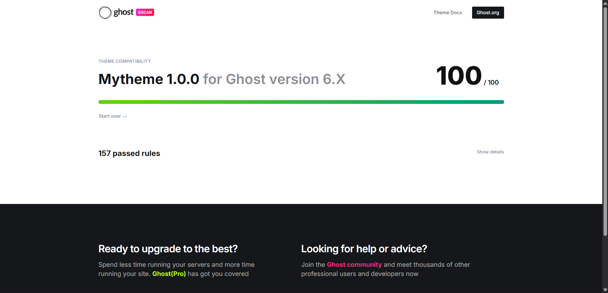

## 📱 Responsive Design Gallery

Below are visual proofs of the theme seamlessly adapting to mobile, tablet, and desktop viewports without horizontal scrolling or overlapping elements.

### 🖥️ Desktop View
*(Scaling flawlessly across large resolution screens)*

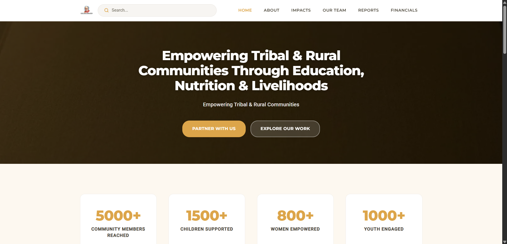
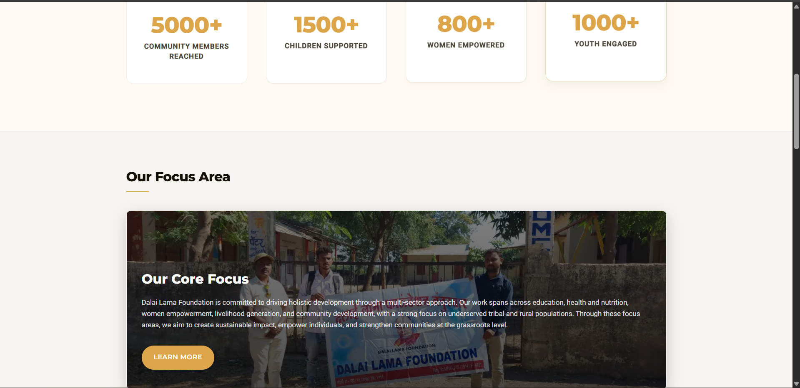
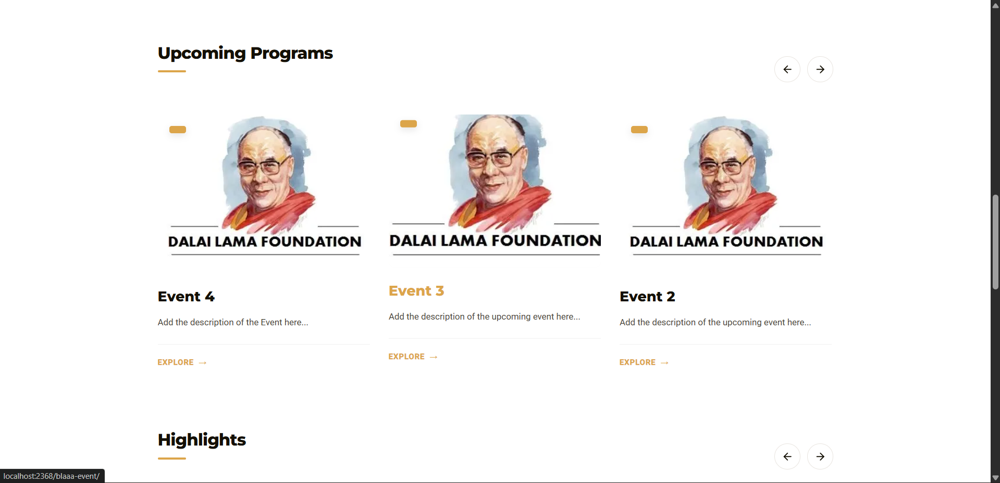
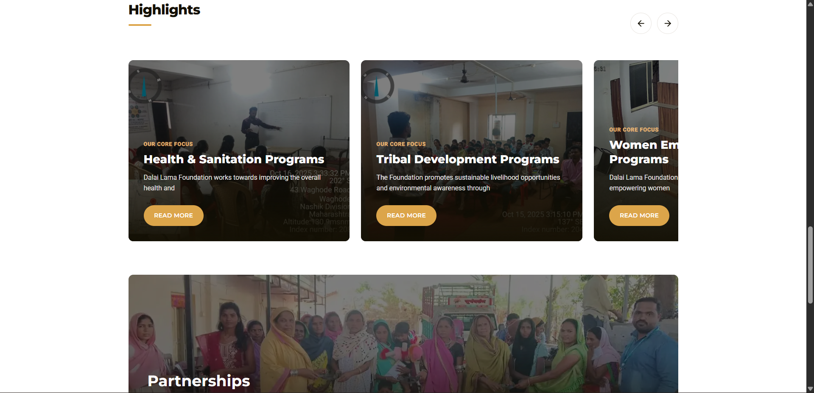
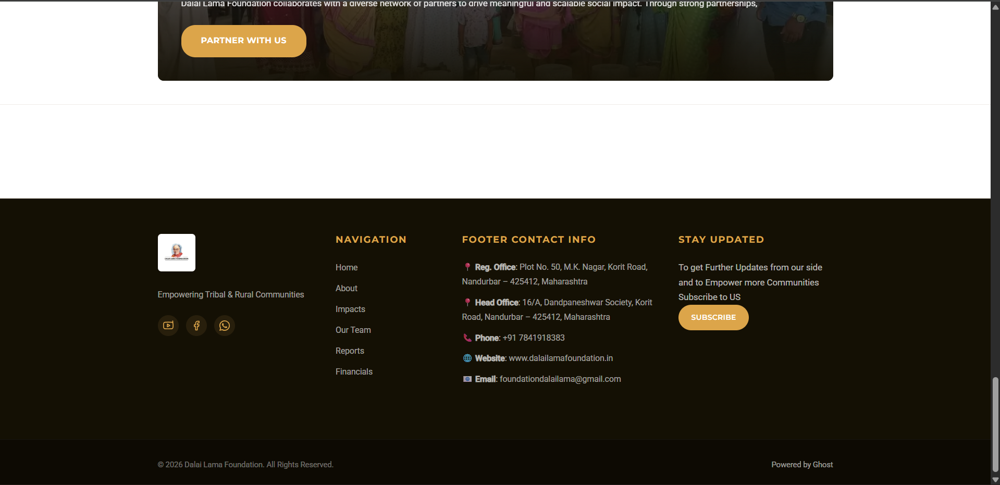
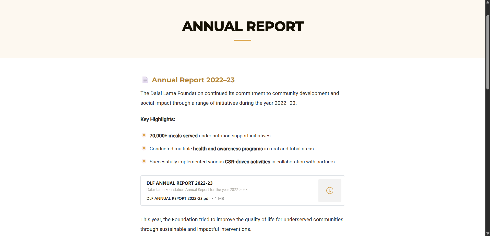

### 📲 Mobile View
*(Tightly optimized for touch targets and mobile reading clarity)*

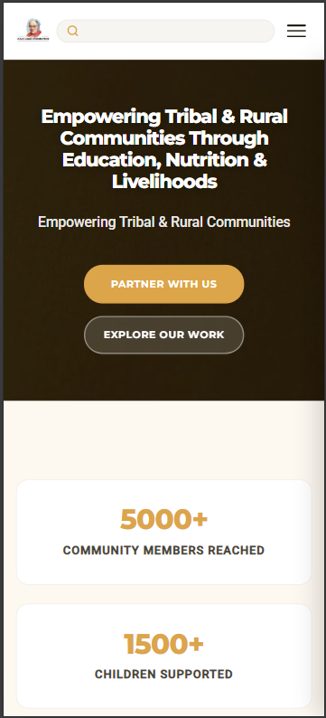
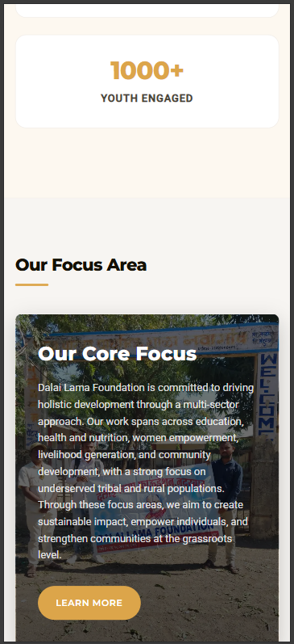
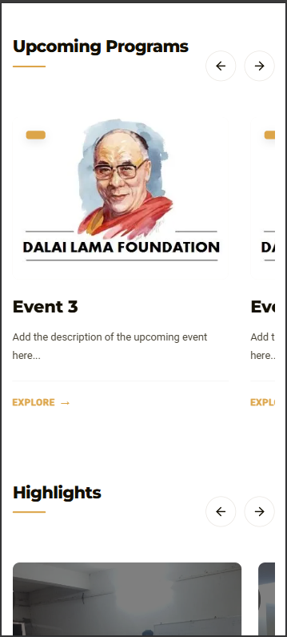
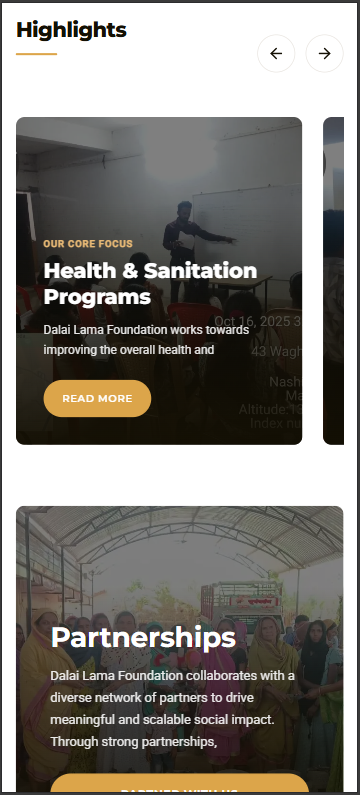
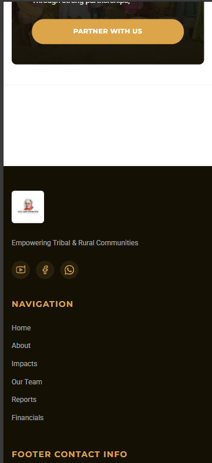
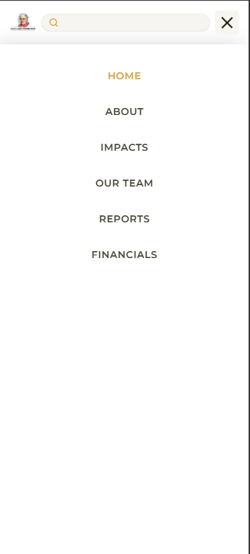
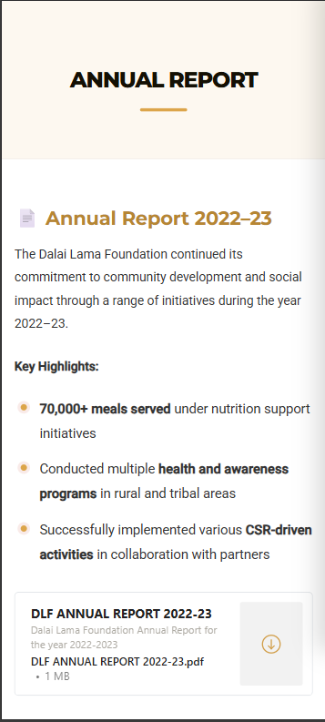

 

---

<i><b>〜 End of Handover Document 〜</b></i>

